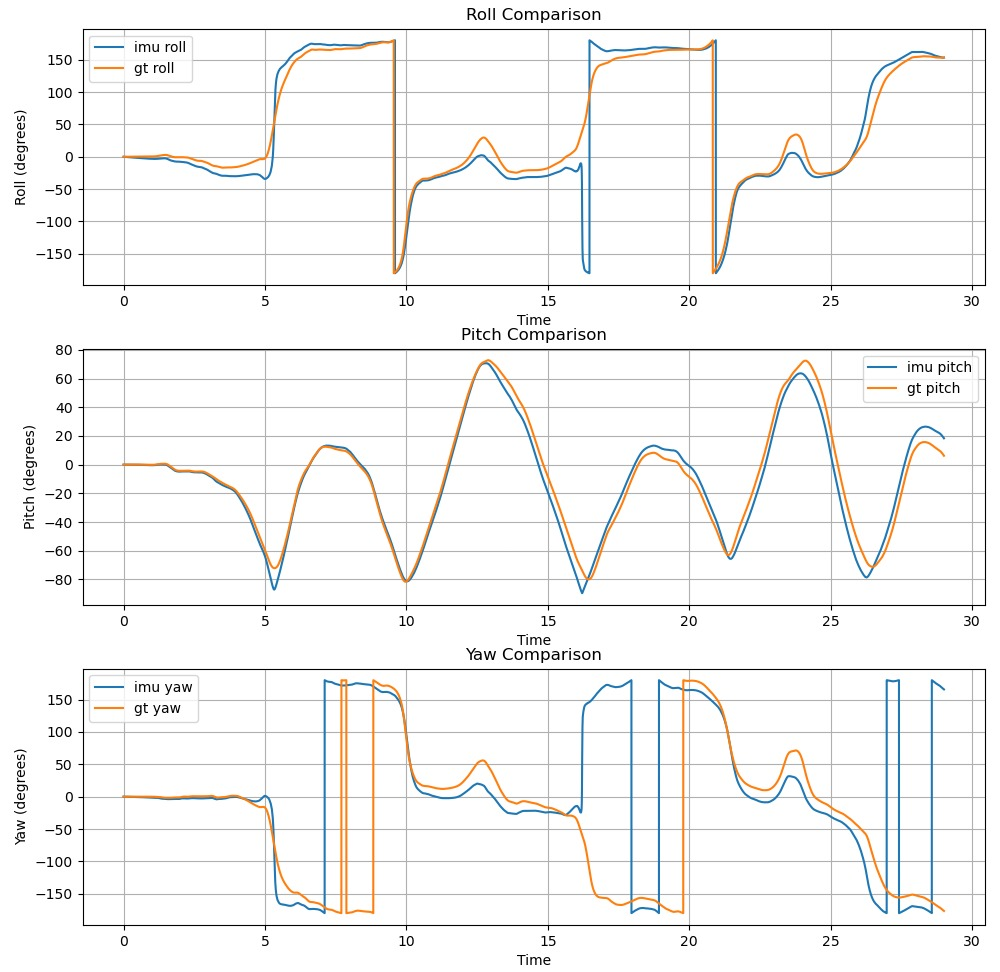

 [](https://codecov.io/gh/KshitijAggarwal8/Visual-Inertial-Odometry) 

# Visual Inertial Odometry
Visual Inertial Odometry (VIO) estimates a device's position and orientation by fusing data from a camera and an Inertial Measurement Unit (IMU). The IMU provides acceleration and angular velocity, while the camera captures visual features for movement tracking. This combination enhances motion tracking accuracy, addressing sensor limitations like IMU drift and visual ambiguity in low light. We fuse the processed measurements using the **Levenberg-Marquardt optimization algorithm**, minimizing residuals between VO-derived and IMU-integrated positions. This approach corrects IMU drift with reliable visual information and mitigates visual errors from lighting or motion blur, resulting in robust position and orientation estimates in challenging conditions.

## Phase 0
Phase 0 involves the proposal for the project, along with information about the methodology that would be used for software development in the project. </br>
<!-- All documents pertaining to the project can be found under `/doc`. </br> -->
Initial Product Backlog link: [Tracking sheet](https://tinyurl.com/bdfh7sdd) </br>
A short video providing a brief overview of the project is provided here: [YouTube](https://www.youtube.com/watch?v=4DxbtCh8VpY)

Project proposal, Activity Diagram, and Quadchart are available in /prod_design.

## Phase 1
Phase 1 involves design and implementation. Minor design improvements, inplementation of IMU, and testing of the pipeline is acheived for Phase 1. The results of the generated trajectory can be simulated via the demo(see below).

Product Dev notes: [Link to the Doc](https://docs.google.com/document/d/1cVjzil5ohEbe0I8bfL9t0BLCOK_g_wfpm6qkm9jk-AY/edit?tab=t.0)




## Build Instructions

### 1. Generate Build Files:
Run the following command to configure the project and generate build files:
```bash
cmake -S . -B build
```

### 2. Compile the Project:
After generating the build files, compile the project from scratch:
```bash
cmake --build build --clean-first
```
To clean the build directory:
```bash
cmake --build build/ --target clean
```

## Documentation Generation

### 1. Build the Documentation:
To generate project documentation, use the following command:
```bash
cmake --build build --target docs
```

### 2. View the Documentation:
Once the documentation is generated, open it in a browser:
```bash
open ./docs/html/index.html
```

## Unit Testing

### Running Unit Tests:
To run unit tests manually, execute:
```bash
ctest --test-dir build/
```

## Test Coverage

### 1. Configure for Coverage:
To generate test coverage reports, set the build type to `Debug` and enable coverage with `WANT_COVERAGE=ON`:
```bash
cmake -D WANT_COVERAGE=ON -D CMAKE_BUILD_TYPE=Debug -S ./ -B build/
```

### 2. Clean Compile and Generate Coverage Report:
Perform a clean compile, run unit tests, and generate the coverage report:
```bash
cmake --build build/ --clean-first --target all test_coverage
```

### 3. View the Coverage Report:
After generating the coverage report, open it in a web browser:
```bash
open build/test_coverage/index.html
```

## Running the Program Executables
To run the executables of the project, the following command must be executed:
```bash
./build/app/app
```

The ouput of the above command would be similar to:
```bash
x_gt: 0.000000
y_gt: 0.000000
z_gt: 0.000000
qx_gt: -0.000014
qy_gt: -0.000024
qz_gt: -0.000009
qw_gt: 1.000000

x_gt: 0.000000
y_gt: 0.000000
z_gt: 0.000000
qx_gt: -0.000051
qy_gt: -0.000040
qz_gt: -0.000015
qw_gt: 1.000000

...
```

To write this to a text file for better processing, run the executable in this manner:
```bash
./build/app/app > output.txt
```

## Collaborators
Apoorv Thapliyal - 190907268 </br>
Kshitij Aggarwal - 119211618

## References
- https://github.com/HKUST-Aerial-Robotics/VINS-Mono
- https://fpv.ifi.uzh.ch/datasets/
- https://ieeexplore.ieee.org/stamp/stamp.jsp?tp=&arnumber=8421746
- https://rpg.ifi.uzh.ch/docs/VO_Part_I_Scaramuzza.pdf

## Warnings
### Euler Angles Conversion Warning

In the current implementation, you may encounter the following warning from `clangd` during Euler angles conversion in `app/main.cpp`: 
```bash
'eulerAngles' is deprecatedclang(-Wdeprecated-declarations)
```
While building, the warning would look something like this:
```bash
In file included from /usr/local/include/eigen3/Eigen/Geometry:39,
                 from /usr/local/include/eigen3/Eigen/Dense:6,
                 from /home/dir/VIO/libs/DataLoader/./data_loader.hpp:19,
                 from /home/dir/VIO/app/main.cpp:12:
/usr/local/include/eigen3/Eigen/src/Geometry/EulerAngles.h:137:1: note: declared here
  137 | MatrixBase<Derived>::eulerAngles(Index a0, Index a1, Index a2) const {
```
This warning can be safely ignored for the purpose of this project. Future versions will include an updated implementation for Euler angle conversions.